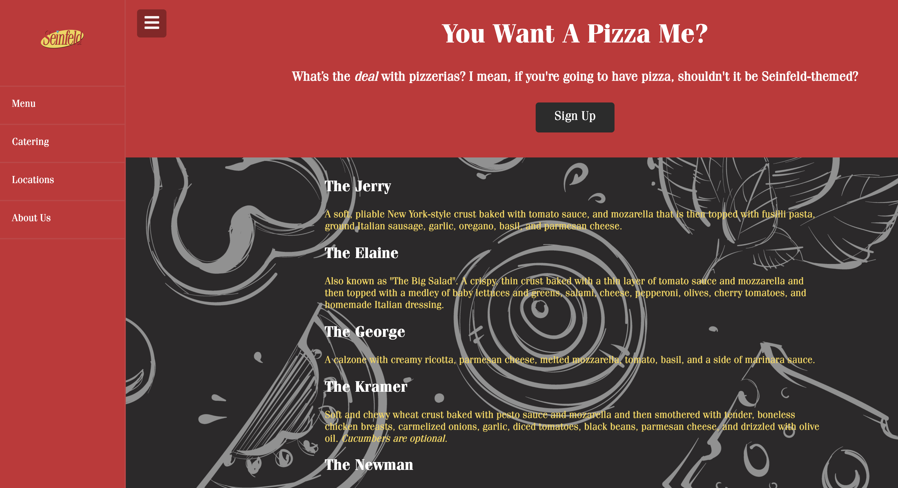

# You Want A Pizza Me?

[](https://opensource.org/licenses/MIT)

## Table of Contents

- [Description](#description)
- [User Story](#user-story)
- [Features of the Application](#features-of-the-application)
- [Preview of You Want A Pizza Me?](#preview-of-you-want-a-pizza-me)
- [Links](#links)
- [Built Using](#built-using)
- [License](#license)
- [Contributing](#contributing)
- [Questions](#questions)

## Description

## User Story

```
AS A
I WANT
SO THAT I
```

## Features of the Application

```
GIVEN
WHEN
THEN

WHEN
THEN

WHEN
THEN
```

## Preview of You Want A Pizza Me?




## Links

- [Deployed Application](https://rh9891.github.io/YouWantAPizzaMe/)

- [Github Repository](https://github.com/rh9891/YouWantAPizzaMe)

## Built Using

Listed below are the frameworks, libraries, and guides that made building this application possible:

- [JavaScript](https://www.w3schools.com/js/default.asp)
- []()
- []()
- [Traversy Media Tutorials](https://www.traversymedia.com)

## License

The MIT License (MIT)

Copyright (c) 2021 Romie Hecdivert

Permission is hereby granted, free of charge, to any person obtaining a copy of this software and associated documentation files (the "Software"), to deal in the Software without restriction, including without limitation the rights to use, copy, modify, merge, publish, distribute, sublicense, and/or sell copies of the Software, and to permit persons to whom the Software is furnished to do so, subject to the following conditions:

The above copyright notice and this permission notice shall be included in all copies or substantial portions of the Software.

THE SOFTWARE IS PROVIDED "AS IS", WITHOUT WARRANTY OF ANY KIND, EXPRESS OR IMPLIED, INCLUDING BUT NOT LIMITED TO THE WARRANTIES OF MERCHANTABILITY, FITNESS FOR A PARTICULAR PURPOSE AND NONINFRINGEMENT. IN NO EVENT SHALL THE AUTHORS OR COPYRIGHT HOLDERS BE LIABLE FOR ANY CLAIM, DAMAGES OR OTHER LIABILITY, WHETHER IN AN ACTION OF CONTRACT, TORT OR OTHERWISE, ARISING FROM, OUT OF OR IN CONNECTION WITH THE SOFTWARE OR THE USE OR OTHER DEALINGS IN THE SOFTWARE.

## Contributing

If you would like to contribute to this repository, please contact me via [Github](https://github.com/rh9891).

## Questions

If you have any questions, comments, or issues regarding this application, please do not hesitate to contact me via [Github](https://github.com/rh9891).
